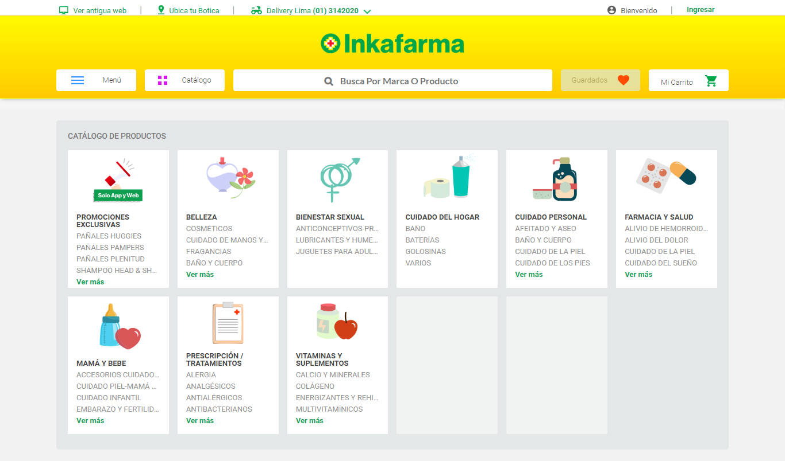

# Card Sorting - Inkafarma

## Reto: 

- Haz un ejercicio de Card Sorting para Inkafarma. La empresa quiere saber si ha categorizado bien los productos o si necesita buscar la manera de encontrar una mejor organización. Si necesita encontrar una mejor forma de organizar, ¿cuál le propondrías?. Realiza el ejercicio de card sorting utilizando mínimo 30 productos y 10 usuarios. Utiliza Optimal Workshop para hacer el card sorting online .

## Situación actual de Inkafarma

## Observaciones encontradas

- Secciones repetitivas, como por ejemplo: Cuidado del hogar es una sección y luego vuelve a aparecer como opción dentro de la sección Belleza.
- Algunos productos se repiten en diferentes secciones, con diferentes nombres.

## Etapas del proceso y algunas herramientas:

- Para poder saber qué está fallando en la Web de Inkafarma, primero haremos un estudio de **TreeJack** en Optimal Workshop.

- Ideación de nueva organización por categorías.

- Para encontrar cuál es el esquema mental de las personas al comprar un producto, utilizaremos **Card Sorting**, también en Optimal Workshop.

- Luego de haber obtenido la data necesaria, se realizará un esquema de los resultados. 

## Treejack

Se realizó este estudio para observar los problemas actuales de la plataforma. A los usuarios se les asignó 3 tareas, en las que tuviesen que interactuar con un menú y encontrar ciertos productos. 

Se asignó 3 tareas y se encontró lo siguiente:

- Media de tiempo en encontrar productos: 2 minutos y 40 segundos.
- Los productos actualemente están fuera de las secciones donde los usuarios creen encontrarlos.
- Se necesitan menos secciones y mejores títulos para algunas de ellas.
- Evitar la repetición de productos en distintas secciones.
- Evitar el cmabio de nombre de productos.

## Card Sorting

Habiendo visto cuáles eran los puntos de mejora, planteamos un estudio de Card Sorting. En el cual, brindamos ciertas categorías y un listado de tarjetas con diferentes productos de la farmacia.

### Este es el estudio:

#### Categorías

#### Tarjetas

### Resultados 

